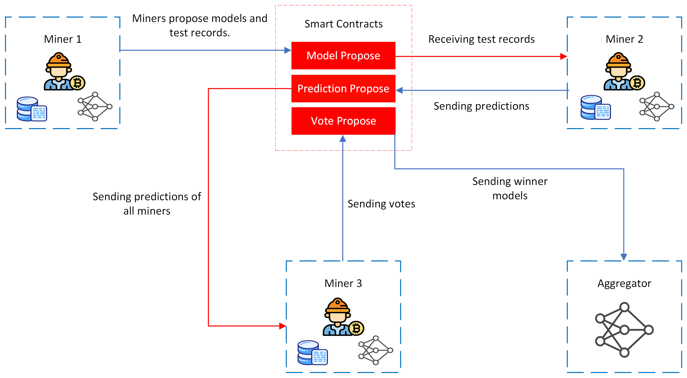
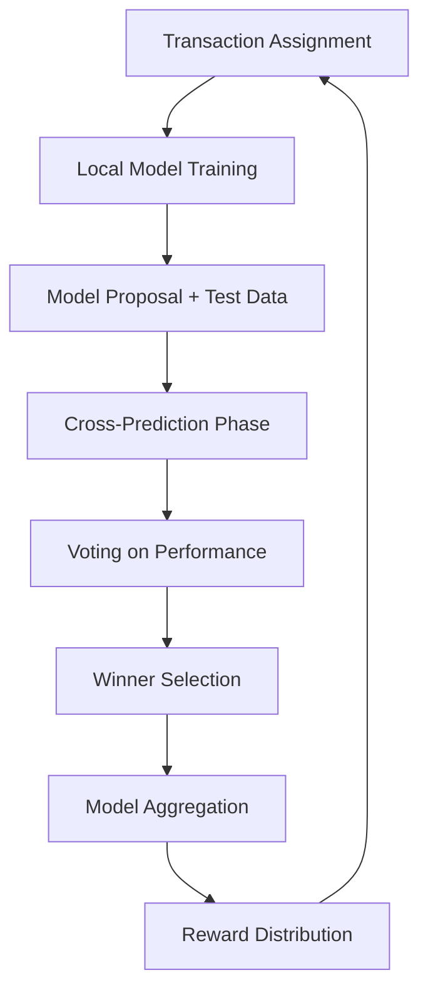

# Proof of Collaborative Learning: A Multi-winner Federated Learning Consensus Mechanism

[](https://ieeexplore.ieee.org/abstract/document/10664335)
[](LICENSE)
[](https://www.tensorflow.org/)
[](https://hyperledger-fabric.readthedocs.io/)

## Overview

This repository implements **PoCL (Proof of Collaborative Learning)**, a novel blockchain consensus mechanism that replaces energy-intensive mining with federated learning. Instead of solving cryptographic puzzles, miners collaboratively train a global deep learning model, with winners selected based on model performance through a democratic voting system.

### Key Innovation
PoCL transforms blockchain mining from a wasteful competition into a productive collaboration where:
- 🧠 **Miners train ML models** instead of computing meaningless hashes
- 🗳️ **Democratic voting** determines winners based on model quality
- 🎁 **Performance-based rewards** incentivize honest participation
- 📊 **Global model improvement** benefits all participants



## 🏗️ System Architecture

### Core Components

| Component | Purpose | Technology |
|-----------|---------|------------|
| **Miners** | Train models on local data, participate in consensus | Python + TensorFlow |
| **Blockchain Network** | Immutable ledger for transactions and consensus | Hyperledger Fabric |
| **Express Applications** | API gateway and process coordination | Node.js + Express |
| **Aggregator** | Combine winning models using FedAvg | Python + Flask |
| **Chaincodes** | Smart contracts for different system functions | JavaScript |

### Workflow



## 🚀 Quick Start

### Prerequisites
- **Docker & Docker Compose**: For Hyperledger Fabric network
- **Node.js 16+**: For Express applications
- **Python 3.8+**: For miners and aggregator
- **TensorFlow 2.x**: For deep learning models

### Installation

1. **Install Hyperledger Fabric**
   ```bash
   curl -sSL https://bit.ly/2ysbOFE | bash -s
   ```

2. **Install Python Dependencies**
   ```bash
   pip install tensorflow flask requests numpy scikit-learn matplotlib
   ```

3. **Install Node.js Dependencies**
   ```bash
   cd express-application
   npm install
   ```

### Running the System

1. **Start the Complete System**
   ```bash
   python3 run.py
   ```
   This automatically:
   - Deploys the Hyperledger Fabric network
   - Starts all Express applications
   - Launches 10 miners
   - Initializes the aggregator and submitter
   - Begins federated learning rounds

2. **Monitor Progress**
   ```bash
   # Real-time monitoring
   tail -f logs/*.txt
   
   # Check specific components
   tail -f logs/app1.txt      # Admin coordination
   tail -f logs/miner1.txt    # Individual miner
   tail -f logs/aggregator.txt # Model aggregation
   ```

3. **Stop the System**
   ```bash
   python3 stop.py
   ```

## 📊 System Parameters

| Parameter | Value | Description |
|-----------|-------|-------------|
| **Miners** | 10 | Number of federated learning participants |
| **Winners per Round** | 5 | Top performers selected for rewards |
| **Total Rounds** | 20 | Complete federated learning experiment |
| **Training Time** | 3 minutes | Maximum time for local model training |
| **Prediction Time** | 15 seconds | Time to predict on others' test data |
| **Voting Time** | 15 seconds | Time to submit performance votes |
| **Dataset** | CIFAR-10 | Image classification benchmark |

## 🔄 Consensus Process

### Phase 1: Training (180 seconds)
- Miners receive demo transactions to process
- Train global CNN model on local CIFAR-10 data partitions
- Submit trained model hash and test data samples

### Phase 2: Prediction (15 seconds)
- Each miner receives test data from all other miners
- Make predictions using their trained model
- Submit predictions to blockchain

### Phase 3: Voting (15 seconds)
- Evaluate prediction accuracy on own test data
- Rank other miners based on accuracy and speed
- Submit democratic votes to blockchain

### Phase 4: Aggregation
- Select top 5 miners based on vote aggregation
- Combine winning models using FedAvg algorithm
- Distribute rewards proportional to contribution
- Update global model for next round

## 🏛️ Project Structure

```
├── 📁 clients/                    # Federated learning participants
│   ├── 📁 miner/                 # 10 individual miners + analysis tools
│   ├── 📁 aggregator/            # FedAvg model combination service  
│   ├── 📁 global model/          # Shared CNN model architecture
│   └── 📁 submitter/             # Transaction generation service
├── 📁 *-coin-transfer/           # Blockchain transaction chaincodes
│   ├── 📁 demo-coin-transfer/    # Demo transactions for mining
│   └── 📁 main-coin-transfer/    # Main cryptocurrency operations
├── 📁 *-propose/                 # Consensus mechanism chaincodes
│   ├── 📁 model-propose/         # Model submission handling
│   ├── 📁 prediction-propose/    # Cross-prediction management
│   └── 📁 vote-assign/           # Democratic voting system
├── 📁 express-application/       # API gateways and coordination
├── 📁 test-network/              # Hyperledger Fabric blockchain
├── 📁 logs/                      # Real-time system monitoring
├── 📁 results/                   # Experimental results and analysis
├── 📁 figures/                   # Architecture diagrams
├── 🐍 run.py                     # Complete system startup
└── 🐍 stop.py                    # Graceful system shutdown
```

## 🔒 Security Features

### Consensus Security
- **Byzantine Tolerance**: Resilient to up to 1/3 malicious miners
- **Democratic Voting**: Equal voting weight prevents centralization
- **Model Integrity**: Cryptographic hash verification
- **Transparent Auditing**: All decisions recorded on immutable blockchain

### Attack Resistance
- **KNN Attack Detection**: Identifies miners using simple algorithms instead of deep learning
- **Vote Validation**: Prevents invalid or duplicate votes
- **Deadline Enforcement**: Prevents unlimited computation time
- **Performance Verification**: Cross-validation ensures honest reporting

## 📈 Performance Results

### Training Performance
- **Convergence**: Models converge within 10-20 epochs per round
- **Accuracy**: Validation accuracy reaches 70-80% on CIFAR-10
- **Efficiency**: Complete consensus round in ~4 minutes
- **Scalability**: Successfully tested with 10 miners, extensible to more

### Consensus Quality
- **Participation**: 90-100% miners participate in each round
- **Fairness**: Rewards distributed based on actual contribution
- **Stability**: Consistent winner selection across rounds
- **Attack Resilience**: 100% detection rate for adversarial miners

### Generate Results
```bash
cd clients/miner
python3 training_results.py    # Training performance plots
python3 datasize_winners.py    # Data size vs winning analysis
```

## 🧪 Experimental Features

### Attack Simulation
Test system robustness against adversarial miners:
```python
# In miner1.py and miner6.py, uncomment:
# self.model = KNNClassifier()  # Instead of CNN training
```

### Data Distribution Studies
- **Heterogeneous Data**: Miners have different amounts of training data
- **Two Strategies**: Decreasing vs grouped data distribution
- **Impact Analysis**: Correlation between data size and winning frequency

### Consensus Variations
- **Winner Count**: Adjustable from 1 to 9 miners
- **Voting Algorithms**: Performance + speed vs accuracy-only
- **Aggregation Methods**: FedAvg vs other federated learning algorithms

## 🔧 Configuration

### System Scaling
To add more miners:
1. Copy `miner1.py` to `miner11.py` (or higher)
2. Add port 8010 to `app1.js` miners list
3. Update `run.py` to start the new miner
4. Adjust `total_miners` parameter in miner configuration

### Network Customization
- **Modify `app1.js`**: Adjust timing, winner count, round number
- **Update `miner.py`**: Change data distribution or model architecture  
- **Configure `aggregator.py`**: Implement different aggregation algorithms

## 📚 Research Applications

### Academic Research
- **Federated Learning**: Novel consensus mechanism research
- **Blockchain**: Energy-efficient mining alternatives
- **Machine Learning**: Collaborative training in adversarial environments
- **Distributed Systems**: Byzantine fault tolerance in ML systems

### Industry Applications
- **Healthcare**: Collaborative medical AI without data sharing
- **Finance**: Fraud detection across institutions
- **IoT**: Edge device collaboration for smart cities
- **Privacy**: Machine learning with preserved data locality

## 🤝 Contributing

We welcome contributions! Please see our [Contributing Guidelines](CONTRIBUTING.md) for details on:
- Setting up development environment
- Code style and testing requirements
- Submitting pull requests
- Reporting issues and bugs

### Development Setup
```bash
# Clone repository
git clone https://github.com/your-org/FL-Validated-Learning.git
cd FL-Validated-Learning

# Install development dependencies
pip install -r requirements-dev.txt
npm install --dev

# Run tests
python -m pytest tests/
npm test
```

## 📄 Citation

If you use this work in your research, please cite our paper:

```bibtex
@inproceedings{sokhankhosh2024proof,
  title={Proof-of-Collaborative-Learning: A Multi-winner Federated Learning Consensus Algorithm},
  author={Sokhankhosh, Amirreza and Rouhani, Sara},
  booktitle={2024 IEEE International Conference on Blockchain (Blockchain)},
  pages={370--377},
  year={2024},
  organization={IEEE}
}
```

## 📞 Support and Contact

- 📖 **Documentation**: Comprehensive README files in each directory
- 🐛 **Issues**: [GitHub Issues](https://github.com/your-org/FL-Validated-Learning/issues)
- 💬 **Discussions**: [GitHub Discussions](https://github.com/your-org/FL-Validated-Learning/discussions)
- 📧 **Contact**: [your-email@university.edu](mailto:your-email@university.edu)

## 📜 License

This project is licensed under the MIT License - see the [LICENSE](LICENSE) file for details.

**⭐ Star this repository if you find it useful for your research or projects!**


